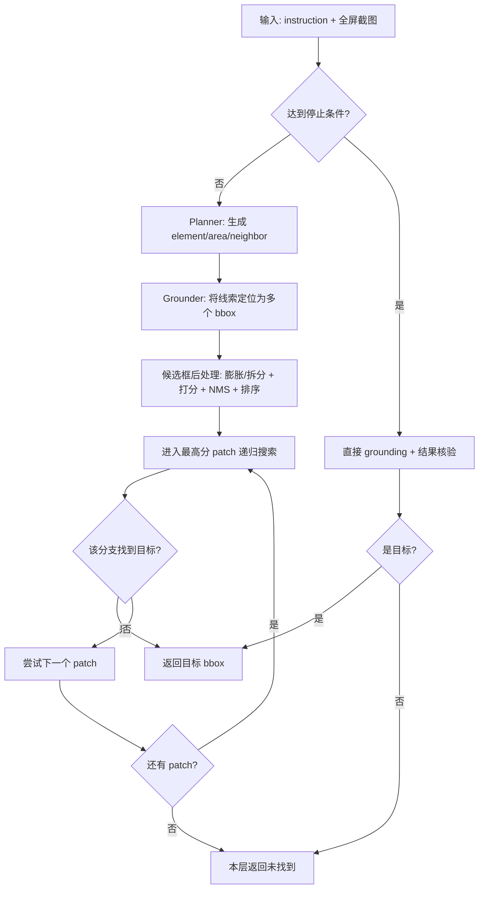

> 这篇文章聚焦一个核心问题：**ScreenSpot-Pro 里的 ScreenSeekeR 到底是怎么设计出来的，为什么有效，代码里又是如何落地的？**  
> 结论先行：它不是“再训一个更强模型”，而是把“规划（planner）”和“定位（grounder）”拆开，通过**递归视觉搜索 + 候选区域重排序**，把高分辨率 GUI 定位问题转化成更容易的局部定位问题。

---

## 1. 背景：为什么 ScreenSpot-Pro 会难这么多？

根据论文《ScreenSpot-Pro: GUI Grounding for Professional High-Resolution Computer Use》，任务难度主要来自三点：

1. **分辨率高**（常见 2K/4K，甚至多屏拼接），而现有多模态模型有效输入分辨率有限。  
2. **目标 UI 相对面积极小**（论文统计平均仅约 0.07% 屏幕面积）。  
3. **专业软件布局复杂**（IDE/CAD/创意软件/科研软件等，层级深、元素密、图标专业化）。

这导致“端到端直接在全屏做一次 grounding”通常效果很差。论文中，OS-Atlas-7B 直接做只有 **18.9%**。

---

## 2. ScreenSeekeR 的核心思想

ScreenSeekeR 是一个 **agentic visual search framework**，核心是：

- 用一个强视觉理解模型（planner，论文与代码中用 GPT-4o）做**位置推理**；
- 用专门 grounding 模型（grounder，代码里默认 OS-Atlas-7B）做**局部框定位**；
- 通过递归裁剪，把搜索空间层层缩小，直到能可靠定位。

它的设计哲学可以概括成一句话：

> **Planner 提供“去哪里找”的先验，Grounder负责“具体框在哪”。**

---

## 3. 论文里的算法结构（抽象层）

论文 Algorithm 1 可以概括为：

1. 在当前 viewport 上做 `Position Inference`（planner 预测可能区域、邻居元素）。
2. 将这些“文字线索”交给 grounder 转成候选框。
3. 对候选框做膨胀/拆分（保证最小可判别尺寸，并避免极端长宽比）。
4. 打分 + NMS + 排序，得到搜索顺序。
5. 按顺序递归进入子图继续搜索。
6. 到达最深层或最小尺寸时，直接 grounding，并由 planner 做“结果核验”。

论文里最关键的一个点是候选打分函数：对“投票框中心点”采用高斯中心偏置（\(\sigma=0.3\)），更偏好“投票点落在候选中心附近”的区域，避免大框天然占优。

---

## 4. 官方代码里的落地设计（实现层）

下面基于官方仓库 `ScreenSpot-Pro-GUI-Grounding` 的 `models/methods/screenseeker.py` 讲实现。

### 4.1 角色分工：Planner + Grounder

在 `model_factory.py` 中，`model_type=="screenseeker"` 时默认组装为：

- `planner`: `gpt-4o-2024-05-13`
- `grounder`: `OSAtlas7BVLLMModel`

也就是说 ScreenSeekeR 本身不训练新 backbone，而是一个**组合式 agent**。

---

### 4.2 Position Inference：先让 planner 生成“搜索线索”

`POSITION_INFERENCE_PROMPT_TOP_LEVEL` 明确要求 planner 输出三类 XML 标签：

- `<element>`：目标元素描述
- `<area>`：可能区域描述
- `<neighbor>`：邻近锚点元素描述

然后 `extract_ui_ref_in_response()` 解析这些标签，形成候选线索集合。

这一步本质是把“难定位任务”先转成“语义可检索线索集”。

---

### 4.3 候选框生成：所有线索都交给 grounder 再定位

在 `visual_search()` 里，代码会：

1. 先对原指令做一次 direct grounding（作为候选之一）；  
2. 再对 `<element>/<area>/<neighbor>` 每条线索分别调用 `ground_with_grounder()`；  
3. 把得到的框统一放入 `patches`，并收集 `groundings` 作为“投票源”。

这一步很关键：planner 输出的是**语言锚点**，grounder 把它们都投影为**空间锚点**。

补充一个容易误解的点：在这个实现里，ScreenSeekeR 期望 grounder 返回的是 **bbox**。  
以默认的 OS-Atlas 接入为例，prompt 明确要求 `(with bbox)`，解析逻辑也优先读 `<|box_start|>...<|box_end|>`。  
若某些模型只返回 point，工程上常见做法是转成退化框 `[x, y, x, y]` 或在点周围扩张成小框（同仓库 `ReGroundMethod` 里就有 point->fake bbox 的处理）。

---

### 4.4 候选框后处理：自动扩张 + 长宽比治理

`auto_dilate_patch()` 做了非常实用的工程化处理：

- 若框太小：补齐到最小 patch 尺寸（默认接近 1280×768 量级）；
- 若框过于细长：按长边拆分成多个 patch 再补齐；
- 若框尺寸合理：直接保留。

它解决了高分屏下常见问题：**框虽命中，但小到不足以让后续模型稳定判断**。

---

### 4.5 候选框评分：中心偏置的高斯投票

`score_patch()` 与论文一致，核心逻辑：

- 用每个**投票框（voting box）中心点**去评估候选 patch；
- 点在 patch 外得分为 0；
- 点在 patch 内时按到 patch 中心 \((0.5,0.5)\) 的距离做高斯衰减。

`score_patches()` 对所有投票框求和，得到每个 patch 的总分，再用于排序。

这里“点”的来源是 `groundings` 中每个 bbox 的中心：\(\big((x_1+x_2)/2,\ (y_1+y_2)/2\big)\)。  
所以“点在框里/框外”指的是“该投票中心点是否落在当前候选 patch 内”。

直觉上，这会优先选择“多条线索共同支持，且支持点分布集中”的区域。

---

### 4.6 去重与搜索顺序：NMS + DFS式递归

在 `visual_search()` 中：

1. 先按分数排序；  
2. 再做 NMS（`iou_threshold=0.5`，按排序后的顺序保留高分框）；  
3. 按保留顺序逐个进入子图递归搜索。

这保证了“先搜最可能区域”，并避免重复搜索高度重叠区域。

注意它不是“只进 top-1 就结束”：  
代码会先进入最高分 patch；如果该分支没找到目标，会回溯并继续尝试后续 patch。  
并且每进入一层子图，都会重新执行一轮完整流程（planner 产出 element/area/neighbor -> grounder 定位 -> 评分排序 -> 递归）。

---

### 4.7 终止条件与结果核验：防止“找到了但找错了”

递归停止条件主要有两个：

- 达到 `max_search_depth`（默认 3）；
- 当前图像尺寸已小于最小 crop 要求。

此时会调用 `try_ground_in_patch()`：

1. 先 direct grounding；  
2. 再调用 `check_grounding_result()` 用 planner 看红框是否真是目标；  
3. 若结果是 `target_elsewhere`，则用 planner 改写后的 `new_instruction` 再 grounding 一次。

这个“二次核验”机制在复杂 UI 场景下很有价值，相当于引入了轻量的 self-correction。

---

## 5. 与其它基线方法相比，ScreenSeekeR 强在哪？

论文同一 grounder（OS-Atlas-7B）下对比显示：

- Base OS-Atlas-7B：18.9%
- ReGround：40.2%
- ScreenSeekeR：**48.1%**

关键增益不在“模型更大”，而在“搜索策略更合理”：

1. **不仅围绕初始预测裁一刀**（ReGround），而是多线索候选 + 递归搜索；  
2. **不仅看目标词本身**，还显式建模 area/neighbor；  
3. **不仅有候选，还做排序策略**（高斯中心投票 + NMS）。

论文 ablation 也支持这一点：去掉递归、邻居推理或 patch scoring，性能都会下降。

---

## 6. 一个简化版“流程图思维模型”

可以把 ScreenSeekeR 想成下面的循环：

1. Planner：这类按钮大概率在哪些 panel？旁边通常有什么？  
2. Grounder：把这些语义锚点都变成候选框。  
3. Ranker：哪些候选最值得先看（score + NMS）？  
4. Search：裁图进下一层，重复 1-3。  
5. Verifier：最后让 planner 判断“框到的是不是它”。

它实际上是在模拟人类“找控件”的过程：先定位窗口/工具栏，再看邻近元素，再细化到按钮级别。

### 6.1 简图（流程）

### 6.2 什么时候会停止？最终输出什么？

源码里的停止逻辑可以分成三类：

1. **命中停止（成功）**  
   任一递归分支返回 `terminate_flag=True`，整棵搜索立即停止并向上返回最终 `bbox`。

2. **边界停止（到叶子再判）**  
   在 `visual_search()` 中，若满足以下任一条件就不再继续下钻：  
   - `depth >= max_search_depth`（默认 3）  
   - 当前图像尺寸小于最小 crop 要求（默认约 `1280x768`）  
   然后进入 `try_ground_in_patch()` 做“直接 grounding + planner 核验”。

3. **失败停止（全分支耗尽）**  
   当前层所有候选 patch 都尝试完仍未找到，返回 `False, None`。

最终在 `ground_only_positive()` 的对外返回中：
- 找到时：`result=positive`，并返回 `bbox`，`point` 为该 bbox 中心点；  
- 未找到时：`result=negative`，`bbox=None`，`point=None`。

---

## 7. 复现与工程使用建议

如果你想把这套方法迁移到自己的 GUI Agent：

1. **保留双模型解耦**：planner 不一定要会精准框选，但要有强 UI 语义理解。  
2. **优先调三个超参**：`max_search_depth`、`min_crop_size`、NMS IoU。  
3. **保证线索多样性**：target/area/neighbor 三类线索缺一不可。  
4. **加入结果核验**：至少做一次 “is_target vs elsewhere” 的检查。  
5. **按模型能力匹配 crop 尺寸**：论文显示不同 grounder 的最优 crop size 不同。

---

## 8. 我的理解：ScreenSeekeR 的本质价值

ScreenSeekeR 的价值并不只是“在 ScreenSpot-Pro 上刷高分”，更重要的是它展示了一条通用路线：

- 当端到端模型受限于分辨率与目标尺度时，  
- 用 agentic search 把一次难任务拆成多次易任务，  
- 用规划模型的知识去驱动视觉检索，而不是硬塞更大输入分辨率。

这对 computer-use agent 非常实用，尤其是面向真实生产软件（IDE/CAD/创意工具）时。

---

## 参考资料（信息来源）

1. **Paper**: ScreenSpot-Pro: GUI Grounding for Professional High-Resolution Computer Use  
   - arXiv: https://arxiv.org/abs/2504.07981  
   - PDF: https://arxiv.org/pdf/2504.07981
2. **Official Code**:  
   - https://github.com/likaixin2000/ScreenSpot-Pro-GUI-Grounding
   - 核心实现文件：`models/methods/screenseeker.py`、`model_factory.py`、`models/osatlas7b.py`
3. **Project/Leaderboard**:  
   - https://gui-agent.github.io/grounding-leaderboard/

